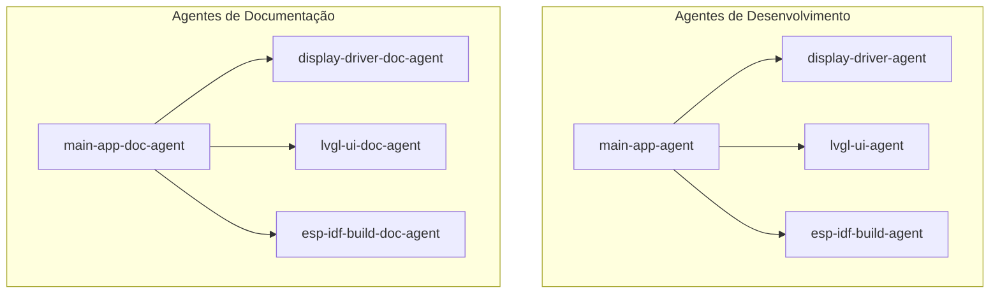

# Arquitetura Multi-Agente do Projeto ESP32 Display LVGL

Este arquivo define a estrutura de agentes especializados responsáveis pelo desenvolvimento e pela documentação de cada subsistema da aplicação ESP32.

---

## 🤖 Visão Geral dos Agentes e Suas Responsabilidades

---

## 📚 Padrão de Atuação de Três Níveis dos Agentes de Documentação

Cada Agente de Documentação atua estritamente em **3 níveis paralelos** para manter o projeto 100% documentado e sincronizado:

1. **Seção no README Principal (`README.md`)**: Atualizar e manter a seção referente ao seu subsistema no README da raiz do projeto.
2. **Manual Técnico & README Local**: Manter o manual técnico em `docs/` e o `README.md` da subpasta correspondente (`main/`, `ui/`).
3. **Comentários no Código-Fonte**: Garantir que todo o código C e scripts CMake sob seu escopo estejam amplamente comentados em **Português (Brasil)**.

---

### 💻 Agentes de Desenvolvimento de Código

1. **📟 Agente Driver Display TFT-SPI (`display-driver-agent`)**
   - **Escopo**: `main/tft_display.h` e `main/tft_display.c`.
   - **Atribuições**: Periférico SPI DMA, registradores ST7735, linhas GPIO e primitivas gráficas.

2. **🎨 Agente Interface Gráfica LVGL (`lvgl-ui-agent`)**
   - **Escopo**: Pasta `ui/` (`screens`, `components`, `fonts`, `images`, `widgets`).
   - **Atribuições**: Vínculo de ativos visuais, telas, componentes e tópicos (`lv_subject_t`) do LVGL v9.

3. **⚙️ Agente Sistema de Compilação & Build (`esp-idf-build-agent`)**
   - **Escopo**: `CMakeLists.txt` (raiz e subpastas), `main/idf_component.yml`, `sdkconfig.defaults`.
   - **Atribuições**: Configuração do CMake, gerenciamento de pacotes e parâmetros do firmware ESP-IDF.

4. **🛠️ Agente Mantenedor dos Scripts CMake (`cmake-maintainer-agent`)**
   - **Escopo**: Todos os arquivos `CMakeLists.txt` (`/`, `main/`, `ui/`) e `sdkconfig.defaults`.
   - **Atribuições**: Resolução automática de diretórios (`EXTRA_COMPONENT_DIRS`), dependências de drivers ESP-IDF v6 (`esp_driver_spi`, `esp_driver_gpio`), macros públicas do LVGL (`LV_LVGL_H_INCLUDE_SIMPLE`) e tabelas de partição (`CONFIG_PARTITION_TABLE_SINGLE_APP_LARGE`).

5. **🧠 Agente Orquestrador & Main App (`main-app-agent`)**
   - **Escopo**: `main/main.c`.
   - **Atribuições**: Ponto de entrada `app_main`, alocação de memória DMA, callback `lvgl_flush_cb`, timer de 1ms e loop FreeRTOS.

---

### 📚 Agentes Especializados em Documentação

1. **📄 Agente de Doc do Driver Display (`display-driver-doc-agent`)**
   - **Nível 1**: Seção 1 do `README.md` raiz.
   - **Nível 2**: `docs/display_driver_doc.md` e `main/README.md`.
   - **Nível 3**: Comentários Doxygen em `main/tft_display.h` e `main/tft_display.c`.

2. **📄 Agente de Doc da Interface LVGL (`lvgl-ui-doc-agent`)**
   - **Nível 1**: Seção 2 do `README.md` raiz.
   - **Nível 2**: `docs/lvgl_ui_doc.md` e `ui/README.md`.
   - **Nível 3**: Comentários em arquivos C/H da pasta `ui/`.

3. **📄 Agente de Doc do Sistema de Build (`esp-idf-build-doc-agent`)**
   - **Nível 1**: Seção 3 do `README.md` raiz.
   - **Nível 2**: `docs/esp_idf_build_doc.md`.
   - **Nível 3**: Comentários explicativos nos arquivos `CMakeLists.txt`, `idf_component.yml` e `sdkconfig.defaults`.

4. **📄 Agente de Doc Mantenedor CMake (`cmake-maintainer-doc-agent`)**
   - **Nível 1**: Seção 3 do `README.md` raiz.
   - **Nível 2**: `docs/esp_idf_build_doc.md`.
   - **Nível 3**: Comentários detalhados em todos os arquivos `CMakeLists.txt`.

5. **📄 Agente de Doc do Orquestrador (`main-app-doc-agent`)**
   - **Nível 1**: Seção 4 do `README.md` raiz.
   - **Nível 2**: `docs/main_app_doc.md` e `main/README.md`.
   - **Nível 3**: Comentários detalhados em `main/main.c`.

---

## 📌 Regras Gerais para Todos os Agentes
1. **Comentários e Documentação**: Todo o código C/CMake e os arquivos `.md` criados ou modificados devem ser amplamente comentados em **Português (Brasil)**.
2. **Nomes Claros e Padrão**: Manter convenções claras de Doxygen para código e GitHub Flavored Markdown / Mermaid para a documentação.
