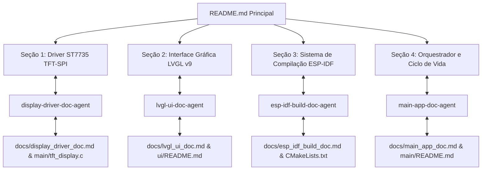

# 🚀 ESP32 LVGL v9 Interface Gráfica (Display ST7735 TFT-SPI)

Este repositório contém o projeto de interface gráfica desenvolvida no **LVGL v9** para o microcontrolador **ESP32** utilizando o framework **ESP-IDF** e o display **ST7735 (128x160 RGB565 via TFT-SPI)**.

A documentação do projeto é gerida de forma descentralizada por **Agentes de Documentação Especializados**, responsáveis por manter este `README.md` principal, seus respectivos manuais em `docs/`, os arquivos `README.md` nas subpastas e os comentários do código-fonte C/CMake.

---

## 🤖 Arquitetura Multi-Agente de Documentação



---

## 📟 1. Driver de Baixo Nível TFT-SPI ST7735
> **Agente Responsável**: `display-driver-doc-agent`  
> **Manual Técnico Detalhado**: [docs/display_driver_doc.md](file:///a:/BackupDesktopFileBruno/Estudos/LVGL/lvgl_vscode_project_teste/Teste-ESP32DisplayFVGL/docs/display_driver_doc.md)  
> **Código Fonte**: [main/tft_display.h](file:///a:/BackupDesktopFileBruno/Estudos/LVGL/lvgl_vscode_project_teste/Teste-ESP32DisplayFVGL/main/tft_display.h) e [main/tft_display.c](file:///a:/BackupDesktopFileBruno/Estudos/LVGL/lvgl_vscode_project_teste/Teste-ESP32DisplayFVGL/main/tft_display.c)

O módulo `tft_display` gerencia a comunicação hardware SPI com DMA entre o ESP32 (`SPI2_HOST`) e o controlador **ST7735**.

### Pinagem de Hardware SPI
- **MOSI**: GPIO 19
- **SCLK**: GPIO 23
- **CS (Chip Select)**: GPIO 14
- **DC (Data/Command)**: GPIO 27
- **RST (Reset)**: GPIO 18
- **BL (Backlight)**: GPIO 4

### Funcionalidades Principais
- Communication SPI a 26 MHz com DMA ativo.
- Definição de janela ativa com comandos ST7735 (`CASET 0x2A`, `RASET 0x2B`, `RAMWR 0x2C`).
- Streaming de pixels RGB565 (`tft_display_draw_raw_pixels`) integrado à callback de flush do LVGL.
- Primitivas gráficas nativas (linhas Bresenham, retângulos, círculos, texto 8x8).

---

## 🎨 2. Interface Gráfica LVGL v9
> **Agente Responsável**: `lvgl-ui-doc-agent`  
> **Manual Técnico Detalhado**: [docs/lvgl_ui_doc.md](file:///a:/BackupDesktopFileBruno/Estudos/LVGL/lvgl_vscode_project_teste/Teste-ESP32DisplayFVGL/docs/lvgl_ui_doc.md)  
> **README do Componente**: [ui/README.md](file:///a:/BackupDesktopFileBruno/Estudos/LVGL/lvgl_vscode_project_teste/Teste-ESP32DisplayFVGL/ui/README.md)

A pasta `ui/` contém a interface gráfica gerada pelo LVGL Editor / LVGL Flow, estruturada para o **LVGL v9**.

### Estrutura de Telas e Componentes
- **Telas**: `preview_home_gen` (tela inicial principal) e `screen1_gen`.
- **Componentes**: `bar`, `column`, `container`, `image`, `label`, `panel`, `row`, `battery_body`, `infobar`.
- **Observer Pattern (`lv_subject_t`)**: Vínculo dinâmico para `subject_battery_level`, `subject_consumo`, `subject_home_artAtual`.

---

## ⚙️ 3. Sistema de Compilação & Build ESP-IDF
> **Agente Responsável**: `esp-idf-build-doc-agent`  
> **Manual Técnico Detalhado**: [docs/esp_idf_build_doc.md](file:///a:/BackupDesktopFileBruno/Estudos/LVGL/lvgl_vscode_project_teste/Teste-ESP32DisplayFVGL/docs/esp_idf_build_doc.md)  
> **Arquivos de Configuração**: [CMakeLists.txt](file:///a:/BackupDesktopFileBruno/Estudos/LVGL/lvgl_vscode_project_teste/Teste-ESP32DisplayFVGL/CMakeLists.txt), [main/idf_component.yml](file:///a:/BackupDesktopFileBruno/Estudos/LVGL/lvgl_vscode_project_teste/Teste-ESP32DisplayFVGL/main/idf_component.yml), [sdkconfig.defaults](file:///a:/BackupDesktopFileBruno/Estudos/LVGL/lvgl_vscode_project_teste/Teste-ESP32DisplayFVGL/sdkconfig.defaults)

O projeto é gerenciado via CMake e **ESP Component Manager**. O pacote `lvgl/lvgl: "^9.2.2"` é baixado e vinculado automaticamente durante a compilação.

### Comandos de Compilação no Terminal ESP-IDF

```bash
# 1. Configurar o microcontrolador ESP32
idf.py set-target esp32

# 2. Compilar o firmware
idf.py build

# 3. Gravar na memória flash e iniciar o monitor serial
idf.py -p COMx flash monitor
```

> **Nota**: Para utilizar o simulador de PC (Win32/SDL2), utilize o arquivo reservado em backup [CMakeLists_simulator.txt](file:///a:/BackupDesktopFileBruno/Estudos/LVGL/lvgl_vscode_project_teste/Teste-ESP32DisplayFVGL/CMakeLists_simulator.txt).

---

## 🧠 4. Orquestrador e Ciclo de Vida da Aplicação
> **Agente Responsável**: `main-app-doc-agent`  
> **Manual Técnico Detalhado**: [docs/main_app_doc.md](file:///a:/BackupDesktopFileBruno/Estudos/LVGL/lvgl_vscode_project_teste/Teste-ESP32DisplayFVGL/docs/main_app_doc.md)  
> **README do Módulo**: [main/README.md](file:///a:/BackupDesktopFileBruno/Estudos/LVGL/lvgl_vscode_project_teste/Teste-ESP32DisplayFVGL/main/README.md)  
> **Código Fonte**: [main/main.c](file:///a:/BackupDesktopFileBruno/Estudos/LVGL/lvgl_vscode_project_teste/Teste-ESP32DisplayFVGL/main/main.c)

O arquivo `main/main.c` coordena a execução do sistema no ESP32:

1. **Hardware**: Inicializa o display TFT-SPI ST7735 (`tft_display_init`).
2. **Memória DMA**: Aloca dois buffers parciais de desenho em memória RAM interna com capacidade DMA (`MALLOC_CAP_DMA | MALLOC_CAP_INTERNAL`).
3. **LVGL v9**: Cria o objeto de display (`lv_display_create`), vincula a callback de flush (`lvgl_flush_cb`) e inicia o timer de hardware (`esp_timer`) de 1 ms (`lv_tick_inc`).
4. **Interface**: Inicializa `ui_init(NULL)` e carrega a tela `preview_home_create()`.
5. **Loop FreeRTOS**: Executa `lv_timer_handler()` continuadamente com atrasos de 5 ms.

---

## 📂 Visão Geral dos Agentes e Documentação

| Agente | Escopo | Manual em `docs/` | README Local | Código Comentado |
| :--- | :--- | :--- | :--- | :--- |
| `display-driver-doc-agent` | Driver ST7735 TFT-SPI | `docs/display_driver_doc.md` | `main/README.md` | `main/tft_display.c/.h` |
| `lvgl-ui-doc-agent` | Interface LVGL v9 | `docs/lvgl_ui_doc.md` | `ui/README.md` | `ui/ui_gen.c`, `ui.c` |
| `esp-idf-build-doc-agent` | CMake e Build | `docs/esp_idf_build_doc.md` | `README.md` (Seção 3) | `CMakeLists.txt`, `sdkconfig` |
| `main-app-doc-agent` | Ciclo de Vida e FreeRTOS | `docs/main_app_doc.md` | `main/README.md` | `main/main.c` |
