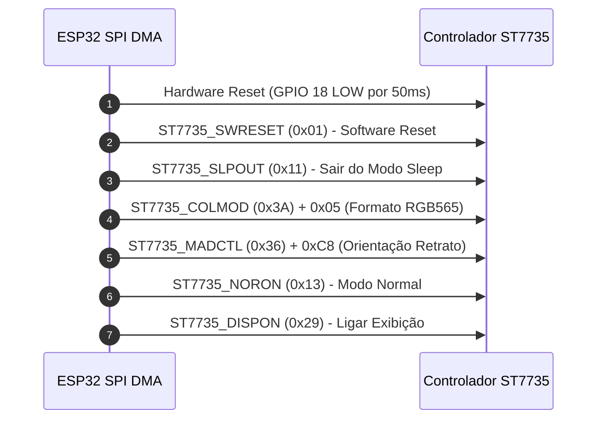

# 📟 Documentação Técnica: Driver Display TFT-SPI ST7735

Esta documentação é mantida pelo **Agente de Documentação do Driver Display** (`display-driver-doc-agent`).

---

## 📌 Visão Geral do Subsistema
O módulo `tft_display` é responsável pela comunicação de baixo nível entre o microcontrolador ESP32 e o controlador gráfico **ST7735** (resolução 128x160 pixels, profundidade de cor RGB565 de 16 bits) através do periférico hardware **SPI2_HOST** com aceleração por **DMA**.

---

## 🔌 Pinagem e Conexões Hardware

| Sinal TFT-SPI | Pino GPIO ESP32 | Função |
| :--- | :--- | :--- |
| **MOSI** | GPIO 19 | Saída de Dados SPI (Master Out Slave In) |
| **SCLK** | GPIO 23 | Sinal de Clock SPI |
| **CS** | GPIO 14 | Chip Select (Ativo em Nível Baixo) |
| **DC** | GPIO 27 | Data / Command Control (0 = Comando, 1 = Dado) |
| **RST** | GPIO 18 | Reset de Hardware (Ativo em Nível Baixo) |
| **BL** | GPIO 4 | Controle do Backlight (Luz de Fundo) |

---

## ⚙️ Sequência de Comando e Inicialização do ST7735

O processo de inicialização do ST7735 segue a seguinte sequência de registradores SPI:

---

## 🛠️ Protótipos e Descrição das Funções C

### `tft_display_init()`
- **Descrição**: Configura os pinos GPIO de controle, inicializa o barramento SPI2 com DMA e envia a sequência de registradores para o ST7735.
- **Retorno**: `esp_err_t` (`ESP_OK` para sucesso).

### `tft_display_set_window(x0, y0, x1, y1)`
- **Descrição**: Seleciona a sub-região ativa da memória de vídeo através dos comandos `CASET (0x2A)`, `RASET (0x2B)` e abre o canal de dados com `RAMWR (0x2C)`.

### `tft_display_draw_raw_pixels(x, y, w, h, pixels_rgb565, len)`
- **Descrição**: Transmite o buffer de pixels RGB565 via transação SPI DMA. Utilizada como a função de entrega (*flush*) da biblioteca LVGL.

### Primitivas Gráficas Auxiliares
- `tft_display_fill_screen(color)`: Preenche toda a tela com uma cor RGB565.
- `tft_display_draw_pixel(x, y, color)`: Desenha um único pixel.
- `tft_display_draw_line(x0, y0, x1, y1, color)`: Linha via algoritmo de Bresenham.
- `tft_display_fill_rect(x, y, w, h, color)`: Retângulo preenchido.
- `tft_display_fill_circle(x0, y0, r, color)`: Círculo preenchido.
- `tft_display_draw_string(x, y, str, fg, bg)`: Renderização de texto com matriz de fonte 8x8.
