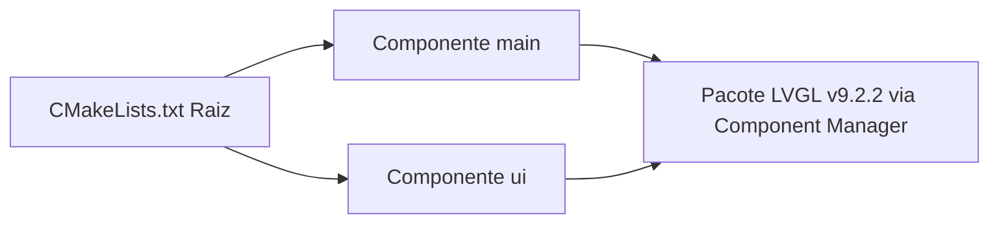

# ⚙️ Documentação Técnica: Sistema de Compilação & Build ESP-IDF

Esta documentação é mantida pelo **Agente de Documentação de Compilação & Build** (`esp-idf-build-doc-agent`).

---

## 📌 Visão Geral do Sistema de Build
O projeto é estruturado utilizando a ferramenta **CMake** no padrão nativo do **ESP-IDF Component Manager**, permitindo a gestão automática do código-fonte, bibliotecas externas e parâmetros do firmware.

---

## 🧱 Componentes do Projeto



### 1. Componente Raiz (`CMakeLists.txt`)
Carrega o ambiente de compilação do ESP-IDF e registra o diretório `ui` como um diretório adicional de componentes:
```cmake
cmake_minimum_required(VERSION 3.16)

# Registra a pasta 'ui' da raiz como um diretório de componentes ESP-IDF
list(APPEND EXTRA_COMPONENT_DIRS "ui")

include($ENV{IDF_PATH}/tools/cmake/project.cmake)
project(Teste-ESP32DisplayFVGL)
```

### 2. Componente `main` (`main/CMakeLists.txt`)
Registra os arquivos C principais e suas dependências:
```cmake
idf_component_register(
    SRCS "main.c" "tft_display.c"
    INCLUDE_DIRS "."
    REQUIRES ui lvgl driver esp_driver_spi esp_driver_gpio esp_timer freertos heap
)
```

### 3. Componente `ui` (`ui/CMakeLists.txt`)
Mapeia recursivamente todas as subpastas da interface e define `LV_LVGL_H_INCLUDE_SIMPLE`:
```cmake
file(GLOB_RECURSE UI_SOURCES "${CMAKE_CURRENT_LIST_DIR}/*.c")
idf_component_register(
    SRCS ${UI_SOURCES}
    INCLUDE_DIRS "." "components" "fonts" "images" "screens" "widgets"
    REQUIRES lvgl
)

# Define a macro para que os arquivos gerados pela UI incluam "lvgl.h" de forma simples
target_compile_definitions(${COMPONENT_LIB} PUBLIC LV_LVGL_H_INCLUDE_SIMPLE)
```

---

## 🎛️ Configurações de Firmware (`sdkconfig.defaults`)

As opções abaixo garantem o suporte a alocação de tarefas FreeRTOS, frequência de tick e recursos de internacionalização/tradução da UI no LVGL v9:

```ini
CONFIG_ESP_MAIN_TASK_STACK_SIZE=8192
CONFIG_FREERTOS_HZ=1000
CONFIG_COMPILER_OPTIMIZATION_PERF=y
CONFIG_LV_USE_TRANSLATION=y
```

---

## 📦 Gerenciador de Pacotes (`main/idf_component.yml`)

O manifesto a seguir especifica o download automático da versão estável do LVGL 9 a partir do ESP Component Registry:
```yaml
dependencies:
  lvgl/lvgl: "^9.2.2"
```

---

## 🛠️ Procedimento de Compilação e Flash

| Passo | Comando | Descrição |
| :--- | :--- | :--- |
| **1** | `idf.py set-target esp32` | Seleciona o microcontrolador ESP32 como alvo |
| **2** | `idf.py build` | Baixa dependências e compila os binários em `build/` |
| **3** | `idf.py -p COMx flash monitor` | Grava na memória flash e inicia o terminal serial |
