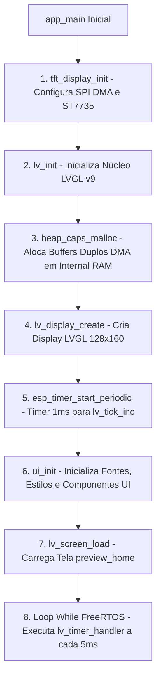

# 🧠 Documentação Técnica: Orquestrador e Ciclo de Vida da Aplicação

Esta documentação é mantida pelo **Agente de Documentação do Orquestrador & Main App** (`main-app-doc-agent`).

---

## 📌 Visão Geral da Arquitetura de Software
O arquivo `main/main.c` atua como o ponto de entrada e orquestrador central do sistema no ESP-IDF. Ele gerencia a alocação de memória RAM com suporte a DMA, conecta o driver de tela `tft_display` à biblioteca gráfica LVGL v9, configura temporizadores de alta precisão e mantém o ciclo de vida do sistema operacional **FreeRTOS**.

---

## 🔄 Fluxo de Execução e Inicialização



---

## ⚡ Alocação de Memória e Transmissão DMA

### Buffers Duplos de Renderização
Para garantir animações fluidas a 60 FPS sem efeito de *tearing*, são alocados dois buffers de desenho no espaço de memória RAM interna acelerada por DMA:

```c
#define DRAW_BUF_HEIGHT 20
#define DRAW_BUF_SIZE   (TFT_WIDTH * DRAW_BUF_HEIGHT * sizeof(uint16_t))

uint8_t *buf1 = heap_caps_malloc(DRAW_BUF_SIZE, MALLOC_CAP_DMA | MALLOC_CAP_INTERNAL);
uint8_t *buf2 = heap_caps_malloc(DRAW_BUF_SIZE, MALLOC_CAP_DMA | MALLOC_CAP_INTERNAL);
```

### Callback de Flush DMA (`lvgl_flush_cb`)
Sempre que o LVGL termina a renderização de uma região parcial, esta função envia os pixels para o ST7735 e libera a área no LVGL:

```c
static void lvgl_flush_cb(lv_display_t * disp, const lv_area_t * area, uint8_t * px_map)
{
    uint32_t width = (area->x2 - area->x1 + 1);
    uint32_t height = (area->y2 - area->y1 + 1);
    size_t len_bytes = width * height * sizeof(uint16_t);

    tft_display_draw_raw_pixels(area->x1, area->y1, width, height, px_map, len_bytes);
    lv_display_flush_ready(disp);
}
```

---

## ⏱️ Temporização do LVGL (Tick de 1ms)
Um temporizador do ESP-IDF (`esp_timer`) dispara periodicamente a cada 1000 µs (1 ms) para garantir o funcionamento correto de timers internos do LVGL, animações e gestos:

```c
static void lvgl_tick_timer_cb(void *arg) {
    lv_tick_inc(1);
}
```
